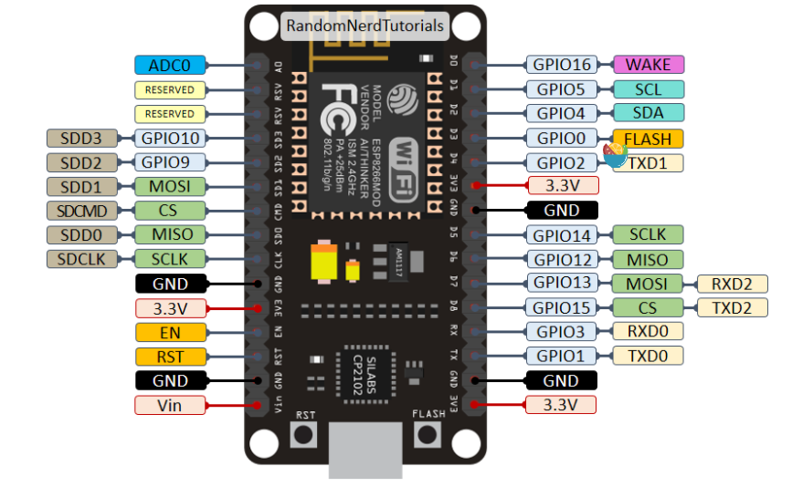

# CASA-0016 Individual Coursework

 Dankao Chen

# Intro

This project designs and implements an air purification device called “Pure-Breath”. The device is based on the ESP8266 development board and provides real-time interaction, air quality monitoring, temperature and humidity display, fan control and other functions by integrating various sensors and modules. The device aims to improve indoor air quality and help users identify and respond to possible air pollution problems.

## P1 Causes of Respiratory Hypersensitiy


## P2 Three Basic Functions of "Pure-Breath"


## P3 The Prototype Design of "Pure-Breath"


However, the work flow or usage of this prototype design was not that detailed.

## P4 Product Prototype Showcase


《图片》


### Equipment features

1. **Air quality monitoring:**
   - Utilizes sensors (e.g. CCS811, MQ135, PMS7003) to monitor the environment in real time
   - including CO₂ concentration, TVOC value, and PM1.0, PM2.5 and PM10 particulate matter concentration.
2. **Temperature and humidity detection:**
   - Use SHT30 sensor to provide accurate ambient temperature and humidity data.
3. **Multi-mode fan control:**
   - Provides three fan modes: auto, on and off to adapt to different air quality needs.
4. **Time Display:**
   - Support synchronized display of London time and Beijing time, realized based on NTP protocol.

### Technical characteristics

1. **Modularized design:**
   - The project is divided into several modules, including sensors, control logic, Wi-Fi connection, LCD display, etc.
   - Each module is developed independently to ensure that the system is easy to expand and maintain.
2. **Non-blocking Architecture:**
   - Use thread timer (RITOS method) instead of the traditional blocking delay (delay) to achieve efficient collaboration among modules.
3. **Double-buffered display:**
   - The use of LCD2004 screen, combined with double buffer technology, reduces I2C communication delay and improves display refresh efficiency (20HZ).
4. **Flexible User Interaction:**
   - Equipped with rotary encoder and keys to support users to quickly switch modes and adjust settings.

### Hardware Composition

- **Main controller chip:** ESP8266, responsible for overall logic control, Wi-Fi connection and data processing.
- **Sensors**:
  - MQ135: Monitor CO₂ concentration.
  - CCS811: Acquire eCO₂ and eTVOC data.
  - PMS7003: Detects PM particulate matter concentration.
  - SHT30: Provides ambient temperature and humidity data.
- **Display Module:** LCD2004, display sensor data and device status.
- **Power supply:** Built-in lithium battery with external power support, can be charged via Type-C or round charging port.


# The Usage of the "Pure-Breath"

Please follow the instructions below while using or maintaining the "Pure-Breath":

## Power Supply of "Pure-Breath"
“Pure-Breath” supports the following two power supply methods:

1. **External power supply**
   - Type-C connector
   - Circular charging connector

2. **Built-in Li-Ion battery**
   - The device can run for about 30 minutes without external power supply.
   - The built-in lithium battery is automatically charged when an external power source is connected. For faster charging, you can turn off the device and charge the battery only.

> **Hint**: One way to increase the battery life of your device is to increase the capacity of the Li-Ion battery, which gives the user a longer battery life experience. (Just like Apple earns high storage space costs by soldering SSDs, just kidding)

《图片》

## Get Start with "Pure-Breath"

1. **Starting the device** 
   
- Slide the switch on the back of the unit to the **"ON"** position. 
  
2. **Start-up process**
   
   - The LCD screen will briefly display a blue screen for about 10 seconds. 
   - During the blue screen, the device connects to Wi-Fi (**CE-Hub-Students**) and synchronizes with world time. 
   - Upon successful connection, the LCD will display a welcome screen and prompt the user to rotate or press the rotary encoder to turn it on. 
  
3. **Main interface and mode selection** 
   Upon startup, you will enter the main user interaction interface with a total of **5 modes** to choose from: 
   - **TIME (London time and Beijing time)** 
   - **T&RH (Temperature and Humidity)**
   - **PM (PM1.0, PM2.5 & PM10)** 
   - **AQI (Air Quality Index)**
   - **FAN (Fan Mode, Auto, On and Off)** 

   **Selection Mode Method**: 
   - Move the pointer to the desired mode by rotating the encoder. 
   - Press the encoder to confirm the selection. 
   
   **Example**: 
	- By selecting the **"TIME"** mode and pressing the encoder, the LCD will display London time and Beijing time. 
	- To exit the current mode, press the green square button to return to the main screen. 

4. **Special operations in FAN mode** 
   **"FAN ’** mode contains **3 sub-modes**: 
   
    - **AUTO** 
    - **ON** 
	- **OFF** 
   
   **Selection of sub-mode method**: 
   
   - Rotate the encoder to point the pointer to the desired sub-mode, then press the green square button to return to the main screen without additional confirmation. 

## Replacing the carbon fiber filter

After the equipment runs for a long time, the carbon fiber filter will inevitably accumulate a lot of dust, so it is extremely important to replace the filter regularly. 

**To replace the air filter, Please follow the following steps:**

《图片1》《图片2》《图片3》《图片4》

> **Very important !!! **

> **Switch off the unit before replacing the filter, do not operate with electricity !!!! **

## Other Precautions
In a clean environment (e.g. laboratory) the PM sensor may show ‘0’, this is normal as there is less particulate matter in the environment. To test the sensor, try the following: 

- Tear a paper towel near the air intake.
- Sprinkle some dust around the unit.

This simulates particulate matter and makes it easier to see how the PM sensor reading changes.

# For Developers

## Repo Structure

```plaintext
- Sensor-Sys/
            - Air_Purify_Sys/
                        - Air_Purify_Sys.ino
                        - MyActuator.h
                        - MyConfig.h
                        - MyCtrlLogic.h
                        - MySensors.h
                        - MyWifi.h
            - Components/
                        - ccs811basic/...
                        - DHT22/...
                        - EasyBtn/...
                        - ESP8266_GetTime/...
                        - I2C_address_search/...
                        - LCD2004/...
                        - ...
            - Datasheets/
                        - EC11-1370808.pdf
                        - SNS-MQ135.pdf
                        - ...
            - images/
                        - Yunli.png
                        - ESP8266-Pins.png
                        - ...
            - README.md
```

The repo contains the following components:
- Air_Purify_Sys/
  - The main program folder, opened with an Arduino and burned into the ESP8266
- Components/
  - Components folder, which contains how to use each component, some of the improved non-blocking runtime programs, and programs for checking circuit connections (e.g., items for checking the connection of I2C devices: I2C_address_search)
- Datasheets/
  - Datasheets for some of the components on which the non-blocking functions of the sensors can be edited.
- images/
  - For storing images in the README
- README.md


## Main program folder - Air_Purify_Sys/
Here is an overview of what each file in the main program does:
### MyConfig.h
- Contains the system configuration and global variable definitions:
  - Define thread timer periods (e.g., periods for Wi-Fi, sensor, display updates).
  - Configure Wi-Fi parameters (SSID and password) and NTP parameters (time zone).
  - Configure sensor and actuator interfaces (e.g., MQ135, CCS811, PMS7003, LCD2004).
  - Configure pins for user interaction (e.g. Encoder and Home Button)
- Provide hardware-related initialization settings:
  - De-jitter time constants for knobs and buttons.
  - Pin mapping and initialization for fans and displays.

### MyCtrlLogic.h
- Implemented control logic:
  - Operation logic based on knob rotation, button press, and Home button.
  - Defines `DISPLAYMODE` state switching rules to control the device's mode of operation.
- Provides input processing threads:
  - Implement knob direction detection (left/right rotation).
  - De-jitter detection of button state change.
  - Real-time response mechanism to user input.

### MySensors.h
- Realizes data reading and processing of various sensors:
  - **MQ135**: Get CO₂ concentration by the calculation formula provided in the datasheet.
  - **CCS811**: Get eCO₂ and eTVOC data, support initialization and error handling.
  - **PMS7003**: Non-blocking reading of particulate matter concentration data, supports frame parsing and calibration.
  - **SHT30**: non-blocking reading of temperature and humidity, supports frame parsing and checksum.
- Provides sensor-specific threads:
  - Ensures that each sensor's data is updated regularly without blocking the rest of the system.

### MyWifi.h

- Implement Wi-Fi connection and time synchronization functions:
  - Wi-Fi connection status checking and reconnection mechanism.
  - NTP time synchronization function to get time in London and China.
- Provide `WorldTimerThread` thread:
  - Periodic output of date and time in current time zone.

### MyActuator.h
- Involves LCD display and fan control:
  - **LCD display**: implements double buffering mechanism to reduce I2C communication time and improve display refresh efficiency (20 Hz).
  - **FAN CONTROL**: set the fan operating mode (auto, on or off) based on `DISPLAYMODE`.
- Defines the content logic of the display mode:
  - Generate display content based on `DISPLAYMODE`, e.g. time, sensor data, air quality.

### Air_Purify_Sys.ino
- Main program file, integrates modules and coordinates system operation:
  - Initialize all modules (Wi-Fi, sensors, control logic, display, etc.).
  - Defines the main loop and schedules the threads to run.
  - May include system error handling and overall state management.

### Collaboration between files
- Modules share state through global variables (e.g. `DISPLAYMODE`, timers).
- Each module is independently responsible for a specific function. The overall design ensures a high degree of modularity and extensibility.


## Pin Diagram & Allocation

### Pin Diagram
Here is the Pin Diagram of ESP8266:

<div align="center">
    
</div>
### Pin Allocation

Here is a table of commonly used pin assignments for ESP8266 development boards (such as NodeMCU or similar), including their functions, GPIO numbers, and key considerations:

| Pin No. | GPIO      | Default Function         | Project Usage           | Common Usage          | Notes                                                                                         |
|---------|-----------|--------------------------|--------------------------|-----------------------|-----------------------------------------------------------------------------------------------|
| D0      | GPIO 16   | Deep Sleep Wake-Up       | NMOS (Fan) (TBD)         | General IO, Low-Frequency Signal | No PWM, I2C, or interrupt support; only supports digital input/output.                       |
| D1      | GPIO 5    | I2C (SCL)               | I2C (SCL) CCS811         | General IO, I2C Clock Signal  | Versatile IO, compatible with most functions.                                                |
| D2      | GPIO 4    | I2C (SDA)               | I2C (SDA) CCS811         | General IO, I2C Data Signal   | Versatile IO, compatible with most functions.                                                |
| D3      | GPIO 0    | Boot Mode Control, Flash Button | CCS811          | General IO (Low Current)     | Must stay HIGH during power-up; otherwise, enters programming mode. Avoid high-frequency or heavy loads. |
| D4      | GPIO 2    | Built-in LED, UART1 TX  | Serial1 Debug            | General IO, LED Control       | HIGH at power-up; use as output only to avoid false resets or boot issues.                   |
| D5      | GPIO 14   | SPI (SCLK)              | Encoder Button           | General IO, SPI Clock Signal | Suitable for high-speed signals.                                                             |
| D6      | GPIO 12   | SPI (MISO)              | Encoder Pin A            | General IO, SPI Data Input    | Suitable for high-speed signals.                                                             |
| D7      | GPIO 13   | SPI (MOSI)              | Encoder Pin B            | General IO, SPI Data Output   | Suitable for high-speed signals.                                                             |
| D8      | GPIO 15   | SPI (CS)                | Home Button (Pull-down Resistor Included) | General IO, SPI Chip Select Signal | Must stay LOW during power-up; not suitable for signals requiring sustained HIGH levels.      |
| RX      | GPIO 3    | UART0 RX                | UART RX PMS7003          | Serial Communication (Receiving Data) | Default USB UART connection for debugging; can be used as input, but conflicts with debugging. |
| TX      | GPIO 1    | UART0 TX                | UART TX PMS7003          | Serial Communication (Sending Data) | Default USB UART connection for debugging; can be used as output, but conflicts with debugging. |
| A0      | ADC0      | Analog Input (0~1V)     | MQ135 (A0)               | Reading Analog Signals (Sensors) | Voltage range limited to 0~1V; requires voltage divider or amplifier for higher voltages.    |

**Notes:**
- Ensure proper GPIO configuration to avoid boot or operational conflicts.
- Consider power-up states and default behaviors when selecting pins for specific tasks.
- Use external resistors or components as necessary to adjust voltage levels or signal characteristics.


